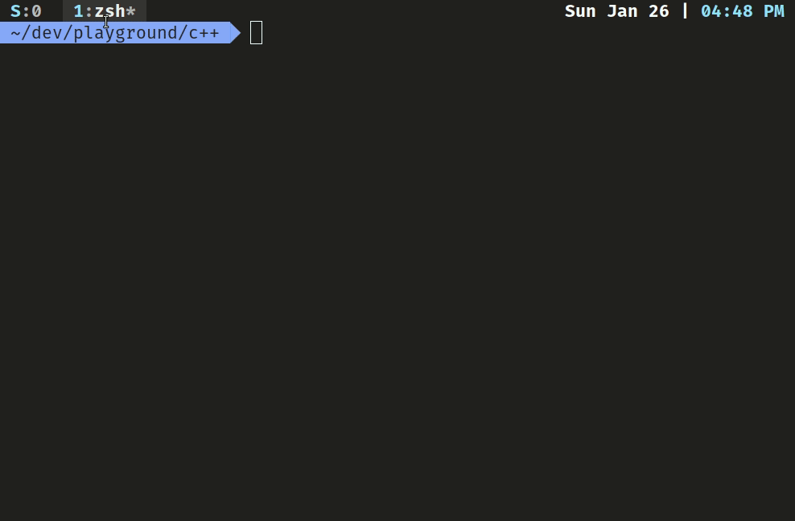

# Dotfiles
*Disclaimer: I am not an Arch user.*

I tend to tinker with shell configs and vim plugins in my free time. 

From my days of disto hopping and vim-tweaks, I have accumulated a crap ton of custom config files. This repo is a deployable dump of all those configs.

Why *deployable* you ask? That's because it is. There's  a nice little bootstrap.sh script that initializes everything on a freshly installed Ubuntu desktop (only tested on 19.10 so far). Really handy for machine hopping.

Here's  a summary of my setup.

|  |  |
|--|--|
|  Terminal	| Alacritty  |
|	Shell | zsh w/ agnoster theme	|
|Multiplexer| Tmux|
|Editor| nvim|
| Shell plugins | fzf w/ oh-my-zsh plugins |

## Shell:

## Vim:

**PS:** Also, here's all about me in a nutshell:  
*nvim > vim > emacs  
Ubuntu > Arch  
tmux > tabbed terminals  
spaces > tabs*  

dont come @ me.

## Author
Banin Abrar | @babrar | baninabrar98@gmail.com
